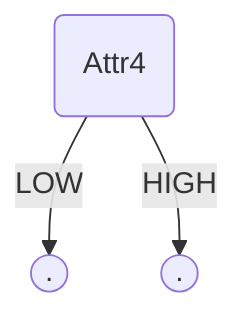
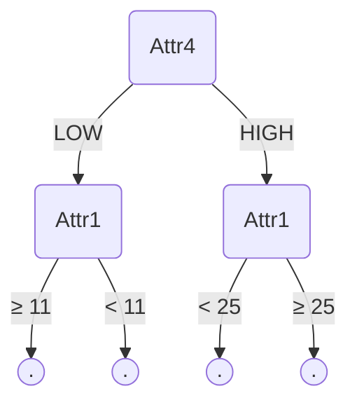
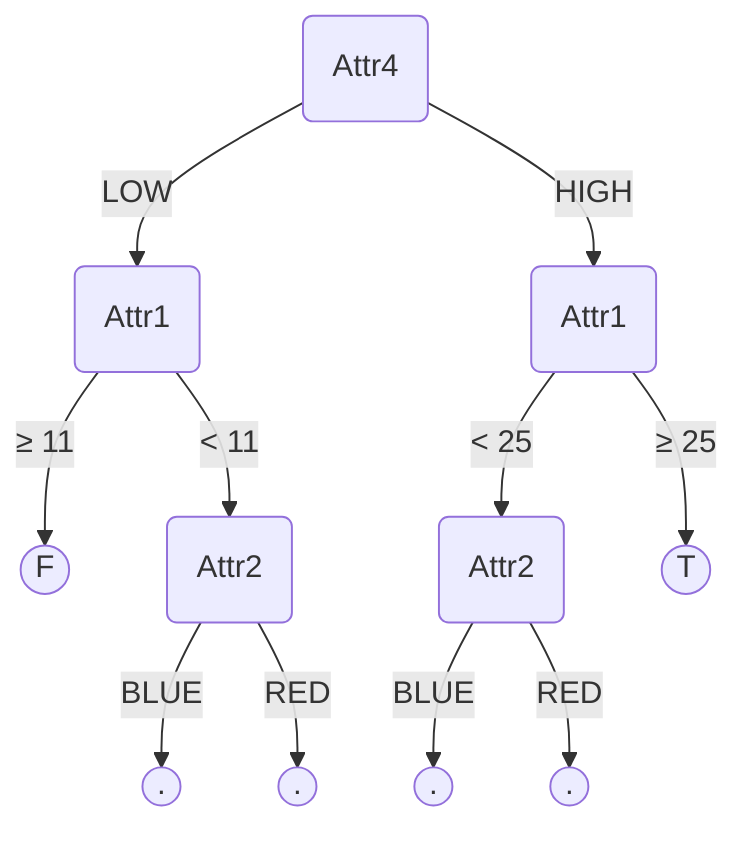
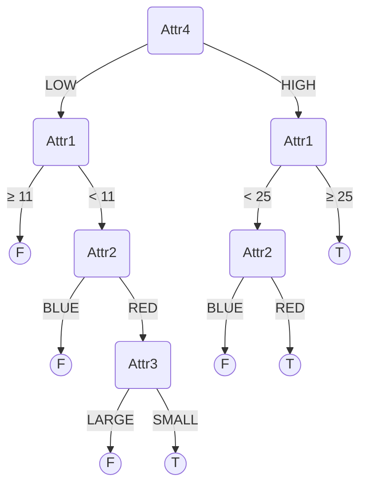
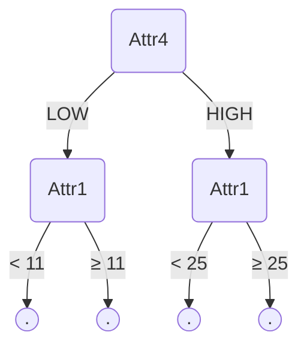
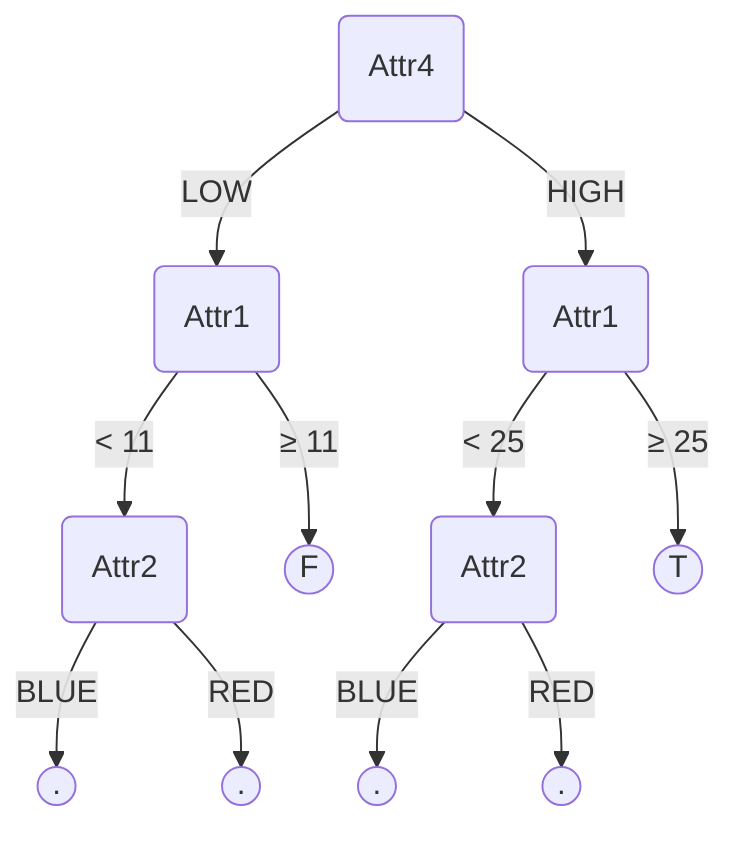
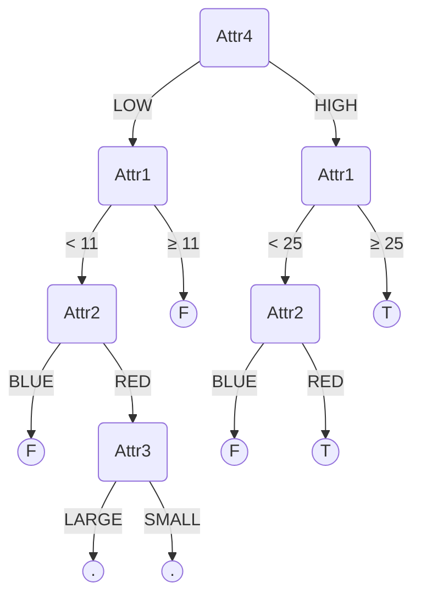
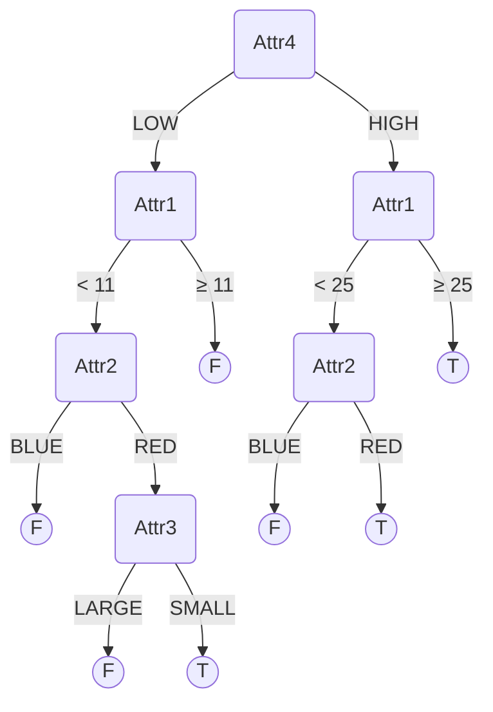

# Q2 - Decision Trees

The data given is as follows - 

| Attr1 | Attr2 | Attr3 | Attr4 | Attr5 | Class |
| :---: | :---: | :---: | :---: | :---: | :---: |
|   3   | BLUE  | SMALL |  LOW  | COOL  |   F   |
|   7   | BLUE  | LARGE | HIGH  | COOL  |   F   |
|  16   | BLUE  | LARGE |  LOW  | COOL  |   F   |
|  17   | BLUE  | LARGE | HIGH  | COOL  |   F   |
|  27   | BLUE  | LARGE | HIGH  |  HOT  |   T   |
|  29   | BLUE  | SMALL | HIGH  |  HOT  |   T   |
|  33   | BLUE  | SMALL |  LOW  |  HOT  |   F   |
|  34   | BLUE  | LARGE | HIGH  |  HOT  |   T   |
|   2   |  RED  | LARGE |  LOW  | COOL  |   F   |
|   6   |  RED  | SMALL |  LOW  | COOL  |   T   |
|  10   |  RED  | SMALL | HIGH  | COOL  |   T   |
|  11   |  RED  | SMALL |  LOW  | COOL  |   F   |
|  25   |  RED  | SMALL | HIGH  |  HOT  |   T   |
|  36   |  RED  | LARGE | HIGH  |  HOT  |   T   |
|  45   |  RED  | SMALL |  LOW  |  HOT  |   F   |
|  50   |  RED  | LARGE |  LOW  |  HOT  |   F   |

# (A) ID3

The entropy of Class label is (9F and 7T) - 

$H(Class) = -[\frac{9}{16}\log_2(\frac{9}{16}) + \frac{7}{16}\log_2(\frac{7}{16})] = 0.9887$

## Root Split

Initial Attribute Specific Entropies (6 as split for Attr1) - 

$H(Class|Attr1) = \frac{1}{8}[-(\frac{0}{2}log_2(\frac{0}{2}) + \frac{2}{2}log_2(\frac{2}{2}))] + \frac{7}{8}[-(\frac{1}{2}log_2(\frac{1}{2}) + \frac{1}{2}log_2(\frac{1}{2}))] = 0.8750$
$IG(Class|Attr1) = H(Class) - H(Class|Attr1) = 0.9887 - 0.8750 = 0.1137$

$H(Class|Attr2) = \frac{1}{2}[-(\frac{3}{8}log_2(\frac{3}{8}) + \frac{5}{8}log_2(\frac{5}{8}))] + \frac{1}{2}[-(\frac{1}{2}log_2(\frac{1}{2}) + \frac{1}{2}log_2(\frac{1}{2}))] = 0.9772$
$IG(Class|Attr2) = H(Class) - H(Class|Attr1) = 0.9887 - 0.9772 = 0.0115$

$H(Class|Attr3) = \frac{1}{2}[-(\frac{1}{2}log_2(\frac{1}{2}) + \frac{1}{2}log_2(\frac{1}{2}))] + \frac{1}{2}[-(\frac{3}{8}log_2(\frac{3}{8}) + \frac{5}{8}log_2(\frac{5}{8}))] = 0.9772$
$IG(Class|Attr3) = H(Class) - H(Class|Attr1) = 0.9887 - 0.9772 = 0.0115$

$H(Class|Attr4) = \frac{1}{2}[-(\frac{7}{8}log_2(\frac{7}{8}) + \frac{1}{8}log_2(\frac{1}{8}))] + \frac{1}{2}[-(\frac{1}{4}log_2(\frac{1}{4}) + \frac{3}{4}log_2(\frac{3}{4}))] = 0.6774$
$IG(Class|Attr4) = H(Class) - H(Class|Attr1) = 0.9887 - 0.6774 = 0.3113$

$H(Class|Attr5) = \frac{1}{2}[-(\frac{5}{8}log_2(\frac{5}{8}) + \frac{3}{8}log_2(\frac{3}{8}))] + \frac{1}{2}[-(\frac{1}{4}log_2(\frac{1}{4}) + \frac{3}{4}log_2(\frac{3}{4}))] = 0.8828$
$IG(Class|Attr5) = H(Class) - H(Class|Attr1) = 0.9887 - 0.8828 = 0.1059$

So we split at Attr4.

## Level 1 Split

### Attr4=high

| Attr1 | Attr2 | Attr3 | Attr4 | Attr5 | Class |
| :---: | :---: | :---: | :---: | :---: | :---: |
|   7   | BLUE  | LARGE | HIGH  | COOL  |   F   |
|  17   | BLUE  | LARGE | HIGH  | COOL  |   F   |
|  27   | BLUE  | LARGE | HIGH  |  HOT  |   T   |
|  29   | BLUE  | SMALL | HIGH  |  HOT  |   T   |
|  34   | BLUE  | LARGE | HIGH  |  HOT  |   T   |
|  10   |  RED  | SMALL | HIGH  | COOL  |   T   |
|  25   |  RED  | SMALL | HIGH  |  HOT  |   T   |
|  36   |  RED  | LARGE | HIGH  |  HOT  |   T   |

$H(Class|Attr4=high) = -[\frac{1}{4}\log_2(\frac{1}{4}) + \frac{3}{4}\log_2(\frac{3}{4})] = 0.8113$

Split at 25 for Attr1 - 

$H(Class|Attr4=high,Attr1) = \frac{3}{8}[-(\frac{2}{3}log_2(\frac{2}{3}) + \frac{1}{3}log_2(\frac{1}{3}))] + \frac{5}{8}[-(\frac{0}{8}log_2(\frac{0}{8}) + \frac{8}{8}log_2(\frac{8}{8}))] = 0.3443$
$IG(Class|Attr4=high,Attr1) = H(Class|Attr4=high) - H(Class|Attr4=high,Attr1) = 0.8113 - 0.3443 = 0.4670$

$H(Class|Attr4=high,Attr2) = \frac{3}{8}[-(\frac{3}{3}log_2(\frac{3}{3}) + \frac{0}{3}log_2(\frac{0}{3}))] + \frac{5}{8}[-(\frac{2}{5}log_2(\frac{2}{5}) + \frac{3}{5}log_2(\frac{3}{5}))] = 0.6068$
$IG(Class|Attr4=high,Attr2) = H(Class|Attr4=high) - H(Class|Attr4=high,Attr2) = 0.8113 - 0.6068 = 0.2045$

$H(Class|Attr4=high,Attr3) = \frac{3}{8}[-(\frac{0}{3}log_2(\frac{0}{3}) + \frac{3}{3}log_2(\frac{3}{3}))] + \frac{5}{8}[-(\frac{2}{5}log_2(\frac{2}{5}) + \frac{3}{5}log_2(\frac{3}{5}))] = 0.6068$
$IG(Class|Attr4=high,Attr3) = H(Class|Attr4=high) - H(Class|Attr4=high,Attr3) = 0.8113 - 0.6068 = 0.2045$

$H(Class|Attr4=high,Attr5) = \frac{3}{8}[-(\frac{2}{3}log_2(\frac{2}{3}) + \frac{1}{3}log_2(\frac{1}{3}))] + \frac{5}{8}[-(\frac{0}{8}log_2(\frac{0}{8}) + \frac{8}{8}log_2(\frac{8}{8}))] = 0.3443$
$IG(Class|Attr4=high,Attr5) = H(Class|Attr4=high) - H(Class|Attr4=high,Attr5) = 0.8113 - 0.3443 = 0.4670$

So we split on Attr1 at 25 for Attr4=high.

### Attr4=low

| Attr1 | Attr2 | Attr3 | Attr4 | Attr5 | Class |
| :---: | :---: | :---: | :---: | :---: | :---: |
|   3   | BLUE  | SMALL |  LOW  | COOL  |   F   |
|  16   | BLUE  | LARGE |  LOW  | COOL  |   F   |
|  33   | BLUE  | SMALL |  LOW  |  HOT  |   F   |
|   2   |  RED  | LARGE |  LOW  | COOL  |   F   |
|   6   |  RED  | SMALL |  LOW  | COOL  |   T   |
|  11   |  RED  | SMALL |  LOW  | COOL  |   F   |
|  45   |  RED  | SMALL |  LOW  |  HOT  |   F   |
|  50   |  RED  | LARGE |  LOW  |  HOT  |   F   |

$H(Class|Attr4=low) = -[\frac{1}{8}\log_2(\frac{1}{8}) + \frac{7}{8}\log_2(\frac{7}{8})] = 0.5436$

Split at 11 for Attr1 - 

$H(Class|Attr4=low,Attr1) = \frac{3}{8}[-(\frac{1}{3}log_2(\frac{1}{3}) + \frac{2}{3}log_2(\frac{2}{3}))] = 0.3443$
$IG(Class|Attr4=low,Attr1) = H(Class|Attr4=low) - H(Class|Attr4=low,Attr1) = 0.5436 - 0.3443 = 0.1992$

$H(Class|Attr4=low,Attr2) = \frac{3}{8}[-(\frac{3}{3}log_2(\frac{3}{3}) + \frac{0}{3}log_2(\frac{0}{3}))] + \frac{5}{8}[-(\frac{1}{5}log_2(\frac{1}{5}) + \frac{4}{5}log_2(\frac{4}{5}))] = 0.4512$
$IG(Class|Attr4=low,Attr2) = H(Class|Attr4=low) - H(Class|Attr4=low,Attr2) = 0.5436 - 0.4512 = 0.0924$

$H(Class|Attr4=low,Attr3) = \frac{3}{8}[-(\frac{0}{3}log_2(\frac{0}{3}) + \frac{3}{3}log_2(\frac{3}{3}))] + \frac{5}{8}[-(\frac{1}{5}log_2(\frac{1}{5}) + \frac{4}{5}log_2(\frac{4}{5}))] = 0.4512$
$IG(Class|Attr4=low,Attr3) = H(Class|Attr4=low) - H(Class|Attr4=low,Attr3) = 0.5436-0.4512 = 0.0924$

$H(Class|Attr4=low,Attr5) = \frac{3}{8}[-(\frac{0}{3}log_2(\frac{0}{3}) + \frac{3}{3}log_2(\frac{3}{3}))] + \frac{5}{8}[-(\frac{1}{5}log_2(\frac{1}{5}) + \frac{4}{5}log_2(\frac{4}{5}))] = 0.4512$
$IG(Class|Attr4=low,Attr5) = H(Class|Attr4=low) - H(Class|Attr4=low,Attr5) = 0.5436-0.4512 = 0.0924$

So we split at Attr1at value 11

## Level 2 Split

### Attr4=high, Attr1≥25

| Attr1 | Attr2 | Attr3 | Attr4 | Attr5 | Class |
| :---: | :---: | :---: | :---: | :---: | :---: |
|  27   | BLUE  | LARGE | HIGH  |  HOT  |   T   |
|  29   | BLUE  | SMALL | HIGH  |  HOT  |   T   |
|  34   | BLUE  | LARGE | HIGH  |  HOT  |   T   |
|  25   |  RED  | SMALL | HIGH  |  HOT  |   T   |
|  36   |  RED  | LARGE | HIGH  |  HOT  |   T   |

As all labels are same(T) this is a leaf node. So we don't proceed further on this branch.

### Attr4=high, Attr1<25

| Attr1 | Attr2 | Attr3 | Attr4 | Attr5 | Class |
| :---: | :---: | :---: | :---: | :---: | :---: |
|   7   | BLUE  | LARGE | HIGH  | COOL  |   F   |
|  17   | BLUE  | LARGE | HIGH  | COOL  |   F   |
|  10   |  RED  | SMALL | HIGH  | COOL  |   T   |

$H(Class|Attr4=high,Attr1<25) = -[\frac{1}{3}\log_2(\frac{1}{3}) + \frac{2}{3}\log_2(\frac{2}{3})] = 0.9183$

$H(Class|Attr4=high,Attr1<25,Attr2) = \frac{1}{3}[-\frac{1}{1}log_2(\frac{1}{1})] + \frac{2}{3}[-\frac{2}{2}log_2(\frac{2}{2})] = 0$
$IG(Class|Attr4=high,Attr1<25,Attr2) = H(Class|Attr4=high,Attr1<25) - H(Class|Attr4=high,Attr1<25,Attr2) = 0.9183$

$H(Class|Attr4=high,Attr1<25,Attr3) = \frac{1}{3}[-\frac{1}{1}log_2(\frac{1}{1})] + \frac{2}{3}[-\frac{2}{2}log_2(\frac{2}{2})] = 0$
$IG(Class|Attr4=high,Attr1<25,Attr3) = H(Class|Attr4=high,Attr1<25) - H(Class|Attr4=high,Attr1<25,Attr3) = 0.9183$

$H(Class|Attr4=high,Attr1<25,Attr5) = \frac{1}{1}[-(\frac{2}{3}log_2(\frac{2}{3}) + \frac{1}{3}log_2(\frac{1}{3}))] = 0.9183$
$IG(Class|Attr4=high,Attr1<25,Attr5) = H(Class|Attr4=high,Attr1<25) - H(Class|Attr4=high,Attr1<25,Attr5) = 0$

We split on Attr2.

### Attr4=low,Attr1≥11

| Attr1 | Attr2 | Attr3 | Attr4 | Attr5 | Class |
| :---: | :---: | :---: | :---: | :---: | :---: |
|  16   | BLUE  | LARGE |  LOW  | COOL  |   F   |
|  33   | BLUE  | SMALL |  LOW  |  HOT  |   F   |
|  11   |  RED  | SMALL |  LOW  | COOL  |   F   |
|  45   |  RED  | SMALL |  LOW  |  HOT  |   F   |
|  50   |  RED  | LARGE |  LOW  |  HOT  |   F   |

As all labels are same(F), this is a leaf node. So we don't proceed further along this branch.

### Attr4=low,Attr1<11

| Attr1 | Attr2 | Attr3 | Attr4 | Attr5 | Class |
| :---: | :---: | :---: | :---: | :---: | :---: |
|   3   | BLUE  | SMALL |  LOW  | COOL  |   F   |
|   2   |  RED  | LARGE |  LOW  | COOL  |   F   |
|   6   |  RED  | SMALL |  LOW  | COOL  |   T   |

$H(Class|Attr4=low,Attr1<11) = -[\frac{2}{3}\log_2(\frac{2}{3}) + \frac{1}{3}\log_2(\frac{1}{3})] = 0.9183$

$H(Class|Attr4=high,Attr1<11,Attr2) = \frac{1}{3}[-\frac{1}{1}log_2(\frac{1}{1})] + \frac{2}{3}[-(\frac{1}{2}log_2(\frac{1}{2})+\frac{1}{2}log_2(\frac{1}{2}))] = 0.6667$
$IG(Class|Attr4=high,Attr1<11,Attr2) = H(Class|Attr4=high,Attr1<11) - H(Class|Attr4=high,Attr1<11,Attr2) = 0.2516$

$H(Class|Attr4=high,Attr1<11,Attr3) = \frac{1}{3}[-\frac{1}{1}log_2(\frac{1}{1})] + \frac{2}{3}[-(\frac{1}{2}log_2(\frac{1}{2})+\frac{1}{2}log_2(\frac{1}{2}))] = 0.6667$
$IG(Class|Attr4=high,Attr1<11,Attr3) = H(Class|Attr4=high,Attr1<11) - H(Class|Attr4=high,Attr1<11,Attr3) = 0.2516$

$H(Class|Attr4=high,Attr1<11,Attr5) = \frac{1}{1}[-(\frac{2}{3}log_2(\frac{2}{3}) + \frac{1}{3}log_2(\frac{1}{3}))] = 0.9183$
$IG(Class|Attr4=high,Attr1<11,Attr5) = H(Class|Attr4=high,Attr1<11) - H(Class|Attr4=high,Attr1<11,Attr5) = 0$

We split on Attr2.

## Level 3 Split

### Attr4=high, Attr1<25, Attr2=red

| Attr1 | Attr2 | Attr3 | Attr4 | Attr5 | Class |
| :---: | :---: | :---: | :---: | :---: | :---: |
|  10   |  RED  | SMALL | HIGH  | COOL  |   T   |

As all labels are same(T), this is a leaf node. So we don't proceed further along this branch.

### Attr4=high, Attr1<25, Attr2=blue

| Attr1 | Attr2 | Attr3 | Attr4 | Attr5 | Class |
| :---: | :---: | :---: | :---: | :---: | :---: |
|   7   | BLUE  | LARGE | HIGH  | COOL  |   F   |
|  17   | BLUE  | LARGE | HIGH  | COOL  |   F   |

As all labels are same(F), this is a leaf node. So we don't proceed further along this branch.

### Attr4=low, Attr1<11, Attr2=blue

| Attr1 | Attr2 | Attr3 | Attr4 | Attr5 | Class |
| :---: | :---: | :---: | :---: | :---: | :---: |
|   3   | BLUE  | SMALL |  LOW  | COOL  |   F   |

As all labels are same(F), this is a leaf node. So we don't proceed further along this branch.

### Attr4=low, Attr1<11, Attr2=red

| Attr1 | Attr2 | Attr3 | Attr4 | Attr5 | Class |
| :---: | :---: | :---: | :---: | :---: | :---: |
|   2   |  RED  | LARGE |  LOW  | COOL  |   F   |
|   6   |  RED  | SMALL |  LOW  | COOL  |   T   |

$H(Class|Attr4=low,Attr2=red,Attr1<11) = -[\frac{1}{2}\log_2(\frac{1}{2}) + \frac{1}{2}\log_2(\frac{1}{2})] = 1.0000$

$H(Class|Attr4=low,Attr2=red,Attr1<11,Attr3) = \frac{1}{2}[-(\frac{1}{1}log_2(\frac{1}{1})] + \frac{1}{2}[-(\frac{1}{1}log_2(\frac{1}{1})] = 0.0000$
$IG(Class|Attr4=low,Attr2=red,Attr1<11,Attr3) = H(Class|Attr4=low,Attr2=red,Attr1<11) - H(Class|Attr4=low,Attr2=red,Attr1<11,Attr3) = 1.000$

$H(Class|Attr4=low,Attr2=red,Attr1<11,Attr5) = \frac{2}{2}[-(\frac{1}{2}log_2(\frac{1}{2}) + \frac{1}{2}log_2(\frac{1}{2}))] = 1.0000$
$IG(Class|Attr4=low,Attr2=red,Attr1<11,Attr5) = H(Class|Attr4=low,Attr2=red,Attr1<11) - H(Class|Attr4=low,Attr2=red,Attr1<11,Attr5) = 0.0000$

So we split on Attr3.

## Level 4 Split

### Attr4=low, Attr2=red, Attr1<11, Attr3=large

| Attr1 | Attr2 | Attr3 | Attr4 | Attr5 | Class |
| :---: | :---: | :---: | :---: | :---: | :---: |
|   2   |  RED  | LARGE |  LOW  | COOL  |   F   |

As all labels are same(F), this is a leaf node. So we don't proceed further along this branch.

###  Attr4=low, Attr2=red, Attr1<11, Attr3=small

| Attr1 | Attr2 | Attr3 | Attr4 | Attr5 | Class |
| :---: | :---: | :---: | :---: | :---: | :---: |
|   6   |  RED  | SMALL |  LOW  | COOL  |   T   |

As all labels are same(T), this is a leaf node. So we don't proceed further along this branch.

# (B) GINI

Gini Score of Class attribute (9F and 7T) - 

$Gini = 1-(\frac{9}{16})^2-(\frac{7}{16})^2 = 0.4922$

## Root Split

Initial Attribute Specific Gini Splits (6 as split for Attr1) - 

$Gini_{split}(Attr1) = \frac{2}{16}[1-(\frac{0}{2})^2 - (\frac{2}{2})^2] + \frac{14}{16}[1-(\frac{7}{14})^2 + (\frac{7}{14})^2] = 0.4375$

$Gini_{split}(Attr2) = \frac{1}{2}[1-(\frac{3}{8})^2 - (\frac{5}{8})^2] + \frac{1}{2}[1-(\frac{4}{8})^2 + (\frac{4}{8})^2] = 0.4843$

$Gini_{split}(Attr3) = \frac{1}{2}[1-(\frac{3}{8})^2 - (\frac{5}{8})^2] + \frac{1}{2}[1-(\frac{4}{8})^2 + (\frac{4}{8})^2] = 0.4843$

$Gini_{split}(Attr4) = \frac{1}{2}[1-(\frac{1}{8})^2 - (\frac{7}{8})^2] + \frac{1}{2}[1-(\frac{1}{4})^2 + (\frac{3}{4})^2] = 0.2969$

$Gini_{split}(Attr5) = \frac{1}{2}[1-(\frac{3}{8})^2 - (\frac{5}{8})^2] + \frac{1}{2}[1-(\frac{1}{4})^2 + (\frac{3}{4})^2] = 0.4218$

The lowest GINI split score is for Attr4. So we split on Attr4.

## Level 1 Split

### Attr4=low

| Attr1 | Attr2 | Attr3 | Attr4 | Attr5 | Class |
| :---: | :---: | :---: | :---: | :---: | :---: |
|   3   | BLUE  | SMALL |  LOW  | COOL  |   F   |
|  16   | BLUE  | LARGE |  LOW  | COOL  |   F   |
|  33   | BLUE  | SMALL |  LOW  |  HOT  |   F   |
|   2   |  RED  | LARGE |  LOW  | COOL  |   F   |
|   6   |  RED  | SMALL |  LOW  | COOL  |   T   |
|  11   |  RED  | SMALL |  LOW  | COOL  |   F   |
|  45   |  RED  | SMALL |  LOW  |  HOT  |   F   |
|  50   |  RED  | LARGE |  LOW  |  HOT  |   F   |

$Gini(Attr4=low) = 1-(\frac{1}{8})^2-(\frac{7}{8})^2 = 0.2187$

Splitting at 11 for Attr1

$Gini_{split}(Attr1|Attr4=low) = \frac{3}{8}[1-(\frac{1}{3})^2 - (\frac{2}{3})^2] + \frac{5}{8}[1-(\frac{5}{5})^2] = 0.1667$

$Gini_{split}(Attr2|Attr4=low) = \frac{3}{8}[1-(\frac{3}{3})^2] + \frac{5}{8}[1-(\frac{4}{5})^2 + (\frac{1}{5})^2] = 0.2000$

$Gini_{split}(Attr3|Attr4=low) = \frac{3}{8}[1-(\frac{3}{3})^2] + \frac{5}{8}[1-(\frac{4}{5})^2 + (\frac{1}{5})^2] = 0.2000$

$Gini_{split}(Attr5|Attr4=low) = \frac{3}{8}[1-(\frac{3}{3})^2] + \frac{5}{8}[1-(\frac{4}{5})^2 + (\frac{1}{5})^2] = 0.2000$

So we split at Attr1 at value 11

### Attr4=high

| Attr1 | Attr2 | Attr3 | Attr4 | Attr5 | Class |
| :---: | :---: | :---: | :---: | :---: | :---: |
|   7   | BLUE  | LARGE | HIGH  | COOL  |   F   |
|  17   | BLUE  | LARGE | HIGH  | COOL  |   F   |
|  27   | BLUE  | LARGE | HIGH  |  HOT  |   T   |
|  29   | BLUE  | SMALL | HIGH  |  HOT  |   T   |
|  34   | BLUE  | LARGE | HIGH  |  HOT  |   T   |
|  10   |  RED  | SMALL | HIGH  | COOL  |   T   |
|  25   |  RED  | SMALL | HIGH  |  HOT  |   T   |
|  36   |  RED  | LARGE | HIGH  |  HOT  |   T   |

$Gini(Attr4=high) = 1-(\frac{1}{4})^2-(\frac{3}{4})^2 = 0.375$

Splitting at 25 for Attr1

$Gini_{split}(Attr1|Attr4=high) = \frac{3}{8}[1-(\frac{1}{3})^2 - (\frac{2}{3})^2] + \frac{5}{8}[1-(\frac{5}{5})^2] = 0.1667$

$Gini_{split}(Attr2|Attr4=high) = \frac{3}{8}[1-(\frac{3}{3})^2] + \frac{5}{8}[1-(\frac{2}{5})^2 + (\frac{3}{5})^2] = 0.3000$

$Gini_{split}(Attr3|Attr4=high) = \frac{3}{8}[1-(\frac{3}{3})^2] + \frac{5}{8}[1-(\frac{2}{5})^2 + (\frac{3}{5})^2] = 0.3000$

$Gini_{split}(Attr5|Attr4=high) = \frac{3}{8}[1-(\frac{1}{3})^2-(\frac{2}{3})^2] + \frac{5}{8}[1-(\frac{5}{5})^2] = 1.667$

So we split at Attr1 at value 25

## Level 2 Split

### Attr4=low, Attr1<11

| Attr1 | Attr2 | Attr3 | Attr4 | Attr5 | Class |
| :---: | :---: | :---: | :---: | :---: | :---: |
|   3   | BLUE  | SMALL |  LOW  | COOL  |   F   |
|   2   |  RED  | LARGE |  LOW  | COOL  |   F   |
|   6   |  RED  | SMALL |  LOW  | COOL  |   T   |

$Gini(Attr4=low,Attr1<11) = 1-(\frac{1}{3})^2-(\frac{2}{3})^2 = 0.4444$

$Gini_{split}(Attr2|Attr4=low,Attr1<11) = \frac{1}{3}[1-(\frac{1}{1})^2] + \frac{2}{3}[1-(\frac{1}{2})^2 + (\frac{1}{2})^2] = 0.3333$

$Gini_{split}(Attr3|Attr4=low,Attr1<11) = \frac{1}{3}[1-(\frac{1}{1})^2] + \frac{2}{3}[1-(\frac{1}{2})^2 + (\frac{1}{2})^2] = 0.3333$

$Gini_{split}(Attr5|Attr4=low,Attr1<11) = \frac{1}{1}[1-(\frac{1}{3})^2 + (\frac{2}{3})^2] = 0.4444$

So we split on Attr2

### Attr4=low, Attr1≥11

| Attr1 | Attr2 | Attr3 | Attr4 | Attr5 | Class |
| :---: | :---: | :---: | :---: | :---: | :---: |
|  16   | BLUE  | LARGE |  LOW  | COOL  |   F   |
|  33   | BLUE  | SMALL |  LOW  |  HOT  |   F   |
|  11   |  RED  | SMALL |  LOW  | COOL  |   F   |
|  45   |  RED  | SMALL |  LOW  |  HOT  |   F   |
|  50   |  RED  | LARGE |  LOW  |  HOT  |   F   |

As all labels are same(F), this is a leaf node. So we don't proceed further along this branch.

### Attr4=high, Attr1<25

| Attr1 | Attr2 | Attr3 | Attr4 | Attr5 | Class |
| :---: | :---: | :---: | :---: | :---: | :---: |
|   7   | BLUE  | LARGE | HIGH  | COOL  |   F   |
|  17   | BLUE  | LARGE | HIGH  | COOL  |   F   |
|  10   |  RED  | SMALL | HIGH  | COOL  |   T   |

$Gini(Attr4=high,Attr1<25) = 1-(\frac{1}{3})^2-(\frac{2}{3})^2 = 0.4444$

$Gini_{split}(Attr2|Attr4=high,Attr1<25) = \frac{1}{3}[1-(\frac{1}{1})^2] + \frac{2}{3}[1-(\frac{1}{1})^2] = 0.0000$

$Gini_{split}(Attr3|Attr4=high,Attr1<25) = \frac{1}{3}[1-(\frac{1}{1})^2] + \frac{2}{3}[1-(\frac{1}{1})^2] = 0.0000$

$Gini_{split}(Attr5|Attr4=high,Attr1<25) = \frac{1}{1}[1-(\frac{1}{3})^2 + (\frac{2}{3})^2] = 0.4444$

So we split on Attr2

### Attr4=high, Attr1≥25

| Attr1 | Attr2 | Attr3 | Attr4 | Attr5 | Class |
| :---: | :---: | :---: | :---: | :---: | :---: |
|  27   | BLUE  | LARGE | HIGH  |  HOT  |   T   |
|  29   | BLUE  | SMALL | HIGH  |  HOT  |   T   |
|  34   | BLUE  | LARGE | HIGH  |  HOT  |   T   |
|  25   |  RED  | SMALL | HIGH  |  HOT  |   T   |
|  36   |  RED  | LARGE | HIGH  |  HOT  |   T   |

As all labels are same(T), this is a leaf node. So we don't proceed further along this branch.

## Level 3 Split

### Attr4=low, Attr1<11, Attr2=blue

| Attr1 | Attr2 | Attr3 | Attr4 | Attr5 | Class |
| :---: | :---: | :---: | :---: | :---: | :---: |
|   3   | BLUE  | SMALL |  LOW  | COOL  |   F   |

As all labels are same(F), this is a leaf node. So we don't proceed further along this branch.

### Attr4=low, Attr1<11, Attr2=red

| Attr1 | Attr2 | Attr3 | Attr4 | Attr5 | Class |
| :---: | :---: | :---: | :---: | :---: | :---: |
|   2   |  RED  | LARGE |  LOW  | COOL  |   F   |
|   6   |  RED  | SMALL |  LOW  | COOL  |   T   |

$Gini(Attr4=low,Attr1<11, Attr2=red) = 1-(\frac{1}{3})^2-(\frac{2}{3})^2 = 0.4444$

$Gini_{split}(Attr3|Attr4=low,Attr1<11, Attr2=red) = \frac{1}{2}[1-(\frac{1}{1})^2] + \frac{1}{2}[1-(\frac{1}{1})^2] = 0.0000$

$Gini_{split}(Attr5|Attr4=low,Attr1<11, Attr2=red) = \frac{1}{1}[1-(\frac{1}{2})^2 + (\frac{1}{2})^2] = 0.5000$

So we split on Attr3

### Attr4=high, Attr1<25, Attr2=blue

| Attr1 | Attr2 | Attr3 | Attr4 | Attr5 | Class |
| :---: | :---: | :---: | :---: | :---: | :---: |
|   7   | BLUE  | LARGE | HIGH  | COOL  |   F   |
|  17   | BLUE  | LARGE | HIGH  | COOL  |   F   |

As all labels are same(F), this is a leaf node. So we don't proceed further along this branch.

### Attr4=high, Attr1<25, Attr2=red

| Attr1 | Attr2 | Attr3 | Attr4 | Attr5 | Class |
| :---: | :---: | :---: | :---: | :---: | :---: |
|  10   |  RED  | SMALL | HIGH  | COOL  |   T   |

As all labels are same(T), this is a leaf node. So we don't proceed further along this branch.

## Split Level 4

### Attr4=low, Attr1<11, Attr2=red, Attr3=large

| Attr1 | Attr2 | Attr3 | Attr4 | Attr5 | Class |
| :---: | :---: | :---: | :---: | :---: | :---: |
|   2   |  RED  | LARGE |  LOW  | COOL  |   F   |

As all labels are same(F), this is a leaf node. So we don't proceed further along this branch.

### Attr4=low, Attr1<11, Attr2=red, Attr3=small

| Attr1 | Attr2 | Attr3 | Attr4 | Attr5 | Class |
| :---: | :---: | :---: | :---: | :---: | :---: |
|   6   |  RED  | SMALL |  LOW  | COOL  |   T   |

As all labels are same(T), this is a leaf node. So we don't proceed further along this branch.

