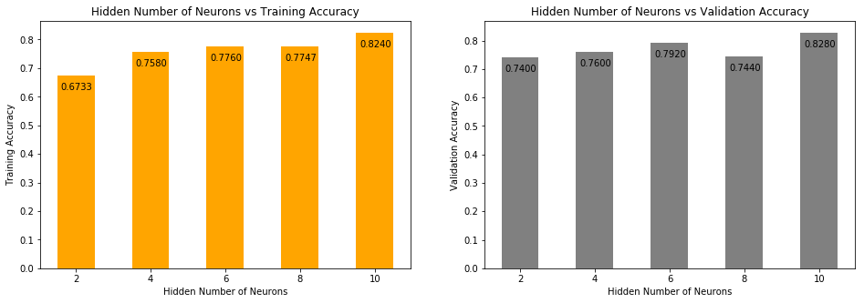

# Q4 - Aritificial Neural Networks

***Train, validate, and test a neural network model using the dataset in hw3q4.zip, which contains training data (75%), validation data (12.5%), and test data (12.5%). There are two output classes in this data set. You can either choose matlab or a python neural networks package, Keras for this problem.***

## Import Libraries


```python
import matplotlib.pyplot as plt
import numpy as np
import zipfile
import math
import sys
import os
np.random.seed(7)
from tensorflow.keras.layers import Activation
from tensorflow.keras.layers import Input
from tensorflow.keras.layers import Dense
from tensorflow.keras import Model
import tensorflow as tf
tf.set_random_seed(7)
%matplotlib inline
```


## (a) Please briefly describe how to construct your working environments (e.g. language, package version, backend for neural networks, installation, etc.) in your report, and write how to execute your codes on 'readme' file.

### Language
- python 3.7

### Prerequisites

- tensorflow 1.8+ (CPU only)
- matplotlib
- numpy

### Installation
Install the above packages using the following commands - 

- tensorflow 1.8+ (CPU only) - `pip install tensorflow`
- matplotlib - `pip install matplotlib`
- numpy - `pip install numpy`

### Data

hw3q4.zip should be in the same directory level as this notebook.


## (b) Keras Model

#### Helper Functions


```python
def get_data(zipname,filename):
    zf = zipfile.ZipFile(zipname)
    data = None
    with zf.open(filename, 'r') as fp:
        data = np.asarray([[float(v.strip()) for v in x.decode().strip().split(',')] for x in fp.readlines()])
    return data
```


```python
def ANN(n_neurons, output_dims):
    input_layer = Input(batch_shape = (None, 61), name='input_layer')
    layer = Dense(n_neurons, name='hidden_layer')(input_layer)
    layer = Activation(activation='relu', name='relu')(layer)
    layer = Dense(output_dims, name='output_layer')(layer)
    output_layer = Activation(activation='sigmoid', name='sigmoid')(layer)
    model = Model(inputs=input_layer, outputs=output_layer, name='ann')
    model.compile('adam', 'mse', ['accuracy'])
    return model
```

#### Read Data


```python
train_x = get_data('Data' + os.sep + 'hw3q4.zip','hw3q4' + os.sep + 'X_train.csv')
train_y = get_data('Data' + os.sep + 'hw3q4.zip','hw3q4' + os.sep + 'Y_train.csv')
val_x = get_data('Data' + os.sep + 'hw3q4.zip', 'hw3q4' + os.sep + 'X_val.csv')
val_y = get_data('Data' + os.sep + 'hw3q4.zip', 'hw3q4' + os.sep + 'Y_val.csv')
test_x = get_data('Data' + os.sep + 'hw3q4.zip', 'hw3q4' + os.sep + 'X_test.csv')
test_y = get_data('Data' + os.sep + 'hw3q4.zip', 'hw3q4' + os.sep + 'Y_test.csv')
```

### (1) Construct neural networks using the given training dataset (X train, Y train) using different number of hidden neurons. Set the parameters as follows: activation function for hidden layer='relu', activation for output layer ='sigmoid', loss function ='mse', metrics= 'accuracy', epochs=10, batch size=50. For each model, change the number of hidden neurons in the order of 2, 4, 6, 8, 10.


```python
hidden_neurons = [2,4,6,8,10]
models = [ANN(hidden_neurons[i], train_y.shape[1]) for i in range(len(hidden_neurons))]
histories = []
for i in range(len(models)):
    print('Training Model with {} neurons in hidden layer'.format(hidden_neurons[i]))
    history = models[i].fit(x=train_x,
                  y=train_y,
                  batch_size=50,
                  epochs=10,
                  shuffle=True)
    histories.append(history)
    print()
```

    Training Model with 2 neurons in hidden layer
    Epoch 1/10
    1500/1500 [==============================] - 0s 273us/step - loss: 0.2538 - acc: 0.5333
    Epoch 2/10
    1500/1500 [==============================] - 0s 25us/step - loss: 0.2481 - acc: 0.5533
    Epoch 3/10
    1500/1500 [==============================] - 0s 24us/step - loss: 0.2432 - acc: 0.5727
    Epoch 4/10
    1500/1500 [==============================] - 0s 25us/step - loss: 0.2387 - acc: 0.5907
    Epoch 5/10
    1500/1500 [==============================] - 0s 24us/step - loss: 0.2338 - acc: 0.6087
    Epoch 6/10
    1500/1500 [==============================] - 0s 25us/step - loss: 0.2285 - acc: 0.6193
    Epoch 7/10
    1500/1500 [==============================] - 0s 22us/step - loss: 0.2229 - acc: 0.6307
    Epoch 8/10
    1500/1500 [==============================] - 0s 22us/step - loss: 0.2164 - acc: 0.6347
    Epoch 9/10
    1500/1500 [==============================] - 0s 22us/step - loss: 0.2095 - acc: 0.6480
    Epoch 10/10
    1500/1500 [==============================] - 0s 25us/step - loss: 0.2022 - acc: 0.6733
    
    Training Model with 4 neurons in hidden layer
    Epoch 1/10
    1500/1500 [==============================] - 0s 195us/step - loss: 0.3337 - acc: 0.4927
    Epoch 2/10
    1500/1500 [==============================] - 0s 25us/step - loss: 0.3077 - acc: 0.5280
    Epoch 3/10
    1500/1500 [==============================] - 0s 24us/step - loss: 0.2827 - acc: 0.5680
    Epoch 4/10
    1500/1500 [==============================] - 0s 25us/step - loss: 0.2596 - acc: 0.5967
    Epoch 5/10
    1500/1500 [==============================] - 0s 37us/step - loss: 0.2387 - acc: 0.6307
    Epoch 6/10
    1500/1500 [==============================] - 0s 27us/step - loss: 0.2213 - acc: 0.6547
    Epoch 7/10
    1500/1500 [==============================] - 0s 24us/step - loss: 0.2066 - acc: 0.6827
    Epoch 8/10
    1500/1500 [==============================] - 0s 23us/step - loss: 0.1944 - acc: 0.7133
    Epoch 9/10
    1500/1500 [==============================] - 0s 26us/step - loss: 0.1840 - acc: 0.7360
    Epoch 10/10
    1500/1500 [==============================] - 0s 24us/step - loss: 0.1753 - acc: 0.7580
    
    Training Model with 6 neurons in hidden layer
    Epoch 1/10
    1500/1500 [==============================] - 0s 209us/step - loss: 0.2943 - acc: 0.4933
    Epoch 2/10
    1500/1500 [==============================] - 0s 25us/step - loss: 0.2667 - acc: 0.5333
    Epoch 3/10
    1500/1500 [==============================] - 0s 26us/step - loss: 0.2441 - acc: 0.5673
    Epoch 4/10
    1500/1500 [==============================] - 0s 25us/step - loss: 0.2260 - acc: 0.6000
    Epoch 5/10
    1500/1500 [==============================] - 0s 25us/step - loss: 0.2110 - acc: 0.6453
    Epoch 6/10
    1500/1500 [==============================] - 0s 27us/step - loss: 0.1988 - acc: 0.6727
    Epoch 7/10
    1500/1500 [==============================] - 0s 26us/step - loss: 0.1883 - acc: 0.7087
    Epoch 8/10
    1500/1500 [==============================] - 0s 27us/step - loss: 0.1791 - acc: 0.7387
    Epoch 9/10
    1500/1500 [==============================] - 0s 31us/step - loss: 0.1711 - acc: 0.7573
    Epoch 10/10
    1500/1500 [==============================] - 0s 23us/step - loss: 0.1643 - acc: 0.7760
    
    Training Model with 8 neurons in hidden layer
    Epoch 1/10
    1500/1500 [==============================] - 0s 214us/step - loss: 0.2895 - acc: 0.5273
    Epoch 2/10
    1500/1500 [==============================] - 0s 25us/step - loss: 0.2614 - acc: 0.5653
    Epoch 3/10
    1500/1500 [==============================] - 0s 26us/step - loss: 0.2389 - acc: 0.6087
    Epoch 4/10
    1500/1500 [==============================] - 0s 27us/step - loss: 0.2202 - acc: 0.6460
    Epoch 5/10
    1500/1500 [==============================] - 0s 27us/step - loss: 0.2051 - acc: 0.6740
    Epoch 6/10
    1500/1500 [==============================] - 0s 29us/step - loss: 0.1924 - acc: 0.7073
    Epoch 7/10
    1500/1500 [==============================] - 0s 28us/step - loss: 0.1815 - acc: 0.7347
    Epoch 8/10
    1500/1500 [==============================] - 0s 25us/step - loss: 0.1725 - acc: 0.7533
    Epoch 9/10
    1500/1500 [==============================] - 0s 25us/step - loss: 0.1647 - acc: 0.7680
    Epoch 10/10
    1500/1500 [==============================] - 0s 23us/step - loss: 0.1580 - acc: 0.7747
    
    Training Model with 10 neurons in hidden layer
    Epoch 1/10
    1500/1500 [==============================] - 0s 268us/step - loss: 0.2728 - acc: 0.5547
    Epoch 2/10
    1500/1500 [==============================] - 0s 28us/step - loss: 0.2387 - acc: 0.6080
    Epoch 3/10
    1500/1500 [==============================] - 0s 26us/step - loss: 0.2110 - acc: 0.6700
    Epoch 4/10
    1500/1500 [==============================] - 0s 25us/step - loss: 0.1890 - acc: 0.7140
    Epoch 5/10
    1500/1500 [==============================] - 0s 29us/step - loss: 0.1722 - acc: 0.7473
    Epoch 6/10
    1500/1500 [==============================] - 0s 22us/step - loss: 0.1596 - acc: 0.7687
    Epoch 7/10
    1500/1500 [==============================] - 0s 29us/step - loss: 0.1499 - acc: 0.7880
    Epoch 8/10
    1500/1500 [==============================] - 0s 22us/step - loss: 0.1425 - acc: 0.8053
    Epoch 9/10
    1500/1500 [==============================] - 0s 28us/step - loss: 0.1364 - acc: 0.8220
    Epoch 10/10
    1500/1500 [==============================] - 0s 26us/step - loss: 0.1315 - acc: 0.8240


### (2) Validate each neural network using the given validation dataset (X val, Y val). The validation accuracy is used to determine how many number of hidden neurons are optimal for this problem.


```python
eval_results = []
for i in range(len(models)):
    print('Evaluating Model with {} neurons in hidden layer'.format(hidden_neurons[i]))
    eval_result = models[i].evaluate(x=val_x, y=val_y, batch_size=50)
    print('Mean Squared Error - {:.4f}'.format(eval_result[0]))
    print('Accuracy - {:.4f}'.format(eval_result[1]))
    eval_results.append(eval_result)
    print()
```

    Evaluating Model with 2 neurons in hidden layer
    250/250 [==============================] - 0s 360us/step
    Mean Squared Error - 0.1976
    Accuracy - 0.7400
    
    Evaluating Model with 4 neurons in hidden layer
    250/250 [==============================] - 0s 346us/step
    Mean Squared Error - 0.1650
    Accuracy - 0.7600
    
    Evaluating Model with 6 neurons in hidden layer
    250/250 [==============================] - 0s 372us/step
    Mean Squared Error - 0.1585
    Accuracy - 0.7920
    
    Evaluating Model with 8 neurons in hidden layer
    250/250 [==============================] - 0s 341us/step
    Mean Squared Error - 0.1595
    Accuracy - 0.7440
    
    Evaluating Model with 10 neurons in hidden layer
    250/250 [==============================] - 0s 318us/step
    Mean Squared Error - 0.1238
    Accuracy - 0.8280


## (c) Plot a figure, where the horizontal x-axis is the number of hidden neurons, and the vertical y-axis is the accuracy. Please plot both training and validation accuracy in your figure. (Note that the exact accuracy could be slightly different according to your working environments, however you can analyze the trend.


```python
fig, ax = plt.subplots(nrows=1, ncols=2, figsize=(16,5))
ax[0].set_title('Hidden Number of Neurons vs Training Accuracy')
ax[0].set_ylabel('Training Accuracy')
ax[0].set_xlabel('Hidden Number of Neurons')
ax[0].bar(hidden_neurons,
          [histories[i].history['acc'][-1] for i in range(len(hidden_neurons))],
          width=1,
          color='orange')
for i in range(len(hidden_neurons)):
    ax[0].annotate('{:.4f}'.format(histories[i].history['acc'][-1]),
                   (hidden_neurons[i]-0.4, histories[i].history['acc'][-1]-0.05))

ax[1].set_title('Hidden Number of Neurons vs Validation Accuracy')
ax[1].set_ylabel('Validation Accuracy')
ax[1].set_xlabel('Hidden Number of Neurons')
ax[1].bar(hidden_neurons,
          [eval_results[i][1] for i in range(len(hidden_neurons))],
          width=1,
          color='gray')
for i in range(len(hidden_neurons)):
    ax[1].annotate('{:.4f}'.format(eval_results[i][1]),
                   (hidden_neurons[i]-0.4, eval_results[i][1]-0.05))
```





## (d) Provide a simple analysis about your results and choose the optimal number of hidden neuron from the analysis.


```python
model = models[4]
```

Based on the above plots, we can clearly see that we get the best validation accuracy when number of neurons in hidden layer is 10. Thus we select the model with 10 neurons in hidden layers.

## (e) Report the test accuracy using the given test dataset (X test, Y test) on the neural network with the optimal number of hidden neurons.


```python
print('Testing Model with 10 neurons in hidden layer')
eval_result = model.evaluate(x=test_x, y=test_y, batch_size=50)
print('Mean Squared Error - {:.4f}'.format(eval_result[0]))
print('Accuracy - {:.4f}'.format(eval_result[1]))
print()
```

    Testing Model with 10 neurons in hidden layer
    250/250 [==============================] - 0s 19us/step
    Mean Squared Error - 0.1594
    Accuracy - 0.7880

Test Accuracy is 0.7880 with 10 neurons in Hidden Layer.
