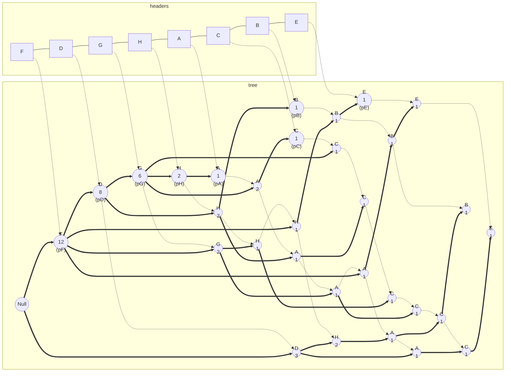
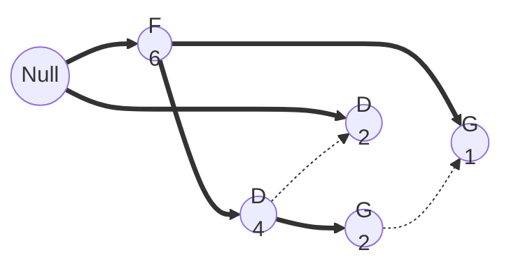
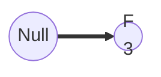

# Q6 - FP-Tree

Consider the following data set shown in Table 4 and answer the following questions using FP-Tree.

| TID  | Items Bought |
| :--: | :----------: |
|  T1  |  {B,D,F,H}   |
|  T2  |  {C,D,F,G}   |
|  T3  |  {A,D,F,G}   |
|  T4  | {A,B,C,D,H}  |
|  T5  |  {A,C,F,G}   |
|  T6  |    {D,H}     |
|  T7  |  {A,B,E,F}   |
|  T8  | {A,D,F,G,H}  |
|  T9  | {A,C,D,F,G}  |
| T10  |  {D,F,G,H}   |
| T11  |  {A,C,D,E}   |
| T12  |  {B,E,F,H}   |
| T13  |   {D,F,G}    |
| T14  |  {C,F,G,H}   |
| T15  | {A,C,D,F,H}  |

## (a) Construct an FP-tree for the set of transactions in the table below as the first step towards identifying the itemsets with minimum support count of 2 (at least 2 occurrences). Do not forget to include the header table that locates the starts of the corresponding linked item lists through the FP-tree. For consistency, please form your header table in the order of {F, D, G, H, A, C, B, E}

### Support Counts / Header Table

| Item | Support |
| :--: | :-----: |
|  F   |   12    |
|  D   |   11    |
|  G   |    8    |
|  H   |    8    |
|  A   |    8    |
|  C   |    7    |
|  B   |    4    |
|  E   |    3    |

### Ordered Itemsets

| TID  | Items Bought | Ordered ItemSets |
| :--: | :----------: | :--------------: |
|  T1  |  {B,D,F,H}   |    {F,D,H,B}     |
|  T2  |  {C,D,F,G}   |    {F,D,G,C}     |
|  T3  |  {A,D,F,G}   |    {F,D,G,A}     |
|  T4  | {A,B,C,D,H}  |   {D,H,A,C,B}    |
|  T5  |  {A,C,F,G}   |    {F,G,A,C}     |
|  T6  |    {D,H}     |      {D,H}       |
|  T7  |  {A,B,E,F}   |    {F,A,B,E}     |
|  T8  | {A,D,F,G,H}  |   {F,D,G,H,A}    |
|  T9  | {A,C,D,F,G}  |   {F,D,G,A,C}    |
| T10  |  {D,F,G,H}   |    {F,D,G,H}     |
| T11  |  {A,C,D,E}   |    {D,A,C,E}     |
| T12  |  {B,E,F,H}   |    {F,H,B,E}     |
| T13  |   {D,F,G}    |     {F,D,G}      |
| T14  |  {C,F,G,H}   |    {F,G,H,C}     |
| T15  | {A,C,D,F,H}  |   {F,D,H,A,C}    |

### Graph

## (b) Using the FP-Tree constructed and support=3, generate all the frequent patterns with the base of item H step by step.

### (i) Conditional FP-Tree with Base H

F, D and G are frequent, so we generate itemsets {F,H}, {D,H} and {G,H}.

### (ii) Conditional FP-Tree with Base GH

Only F is frequent, so we generate itemset {F,G,H}

### (iii) Conditional FP-Tree with Base DH

F is frequent, so we generate itemset {F,D,H}

### (iv) Conditional FP-Tree with base FH

Only Null node remains, so no new itemsets.

As H was frequent too, we generate itemset {H} also. Hence, we have the following frequent patterns - **{H}, {F,H}, {D,H}, {G,H}, {F,D,H}, {F,G,H}**.

